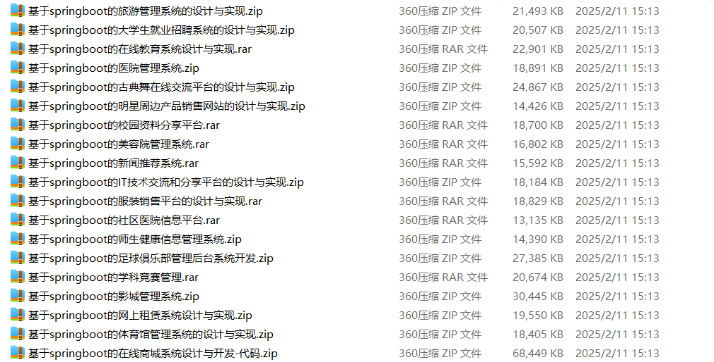

# springboot_campus_competition_job_recruitment_lost_and_found

📦 SpringBoot多功能项目仓库 🎯

本仓库汇集了三个基于 **Spring Boot** 开发的高实用性项目，涵盖**校园竞赛管理**、**求职招聘管理**、**失物招领管理**等多个领域，适用于**高校**、**社团**、**学生事务中心**，助力提升**赛事管理**、**就业服务**、**失物找回**的效率，为校园提供智能化解决方案！🚀

🏆 **校园竞赛管理系统** —— 具备**竞赛报名**、**赛程管理**、**竞赛评审**、**成绩公示**等功能，实现**智能竞赛管理**，适用于**学科竞赛**、**社团比赛**、**校园挑战赛**等场景 🎓📢

💼 **校园求职招聘系统** —— 提供**职位发布**、**简历投递**、**面试安排**、**就业统计**等功能，优化**校园招聘流程**，提高**求职对接效率**，适用于**高校就业中心**、**企业招聘会** 📄✅

🔍 **校园失物招领系统** —— 具备**失物登记**、**寻物匹配**、**失物公告**、**物品归还管理**等功能，助力**校园失物找回**，提高**失物认领成功率**，帮助师生解决遗失物品问题 🎒🔎

**项目部署说明**✨：

推荐使用：**谷歌浏览器**

**后台地址**😎

http://localhost:8080/springboot/admin/dist/index.html

**前台地址**😎

http://localhost:8080/springboot/front/index.html

在**src\main\resources\application.yml中**编辑数据库配置🎉										
url:jdbc:mysql://127.0.0.1:3306/springbootuseUnicode=true&characterEncoding=utf8&useJDBCCompliantTimezoneShift=true&useLegacyDatetimeCode=false&serverTimezone=UTC
username: root
password: 123456

**文档预览**👀

**其他项目合集**✨

